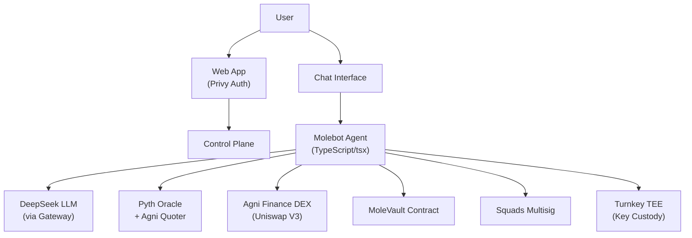

# 🦔 Molebot

> **Autonomous AI Trading Agent — living as a dynamic NFT on Mantle.**
>
> A policy-bound AI agent that trades on your behalf, grows with its P&L, and
> never holds your private keys. Every transaction is signed inside a Turnkey TEE
> under a strict, user-enforced policy. Withdrawals require Squads multisig approval.

[](LICENSE)
[](https://dorahacks.io/hackathon/mantleturingtesthackathon2026)
[](https://molebot.org)

---

## ✨ Features

| Capability | How it works |
|---|---|
| **AI Trading Agent** | Autonomous trading using real-time technical analysis (RSI, SMA crossover). Executes through Agni Finance DEX. |
| **🧬 Living NFT** | Mole's mood changes with P&L. Happy moles unlock accessories. Level grows with cumulative gains. |
| **🔐 Keyless Security** | Private keys never leave Turnkey TEE. Policy restricts which programs can be called, tx sizes, and rate limits. |
| **🏛️ Multisig Withdrawal** | All fund exits require your Squads approval — platform can't move your money. |
| **💬 Chat Interface** | Talk to your Mole. "Open a long ETH/MNT", "close position", "how's my PnL?" — it understands and executes. |
| **🌍 Multi-language** | Chat in any language — the Mole responds in the same language. |

---

## 🏗️ Architecture



**Key contracts (Mantle Sepolia):**
| Contract | Address |
|---|---|
| MolebotNFT | `0xFA9071C5c87c5B940Bf83B030fE52f3500559aCb` |
| AICredits | `0x15Fa9046d2db9E38308Ed9bbA8F8e872beBF6B64` |
| MoleVault | `0x252F0d506Da5131Bdc469796b273c724AB8Bc6F7` |

---

## 🚀 Quick Start

```bash
# 1. Clone
git clone https://github.com/StasPodyachev/molebot-public.git
cd molebot-public

# 2. Install deps
cd agent && npm install
cd ../frontend && npm install
cd ..

# 3. Set up environment
cp .env.example .env
# Fill in: MANTLE_RPC_URL, LLM_API_KEY, TURNKEY credentials

# 4. Start agent (mock mode — no real trades)
cd agent && MOCK_PRICES=true npx tsx src/index.ts

# 5. In another terminal — start frontend
cd frontend && npm run dev

# 6. Open http://localhost:5173
```

---

## 🧪 Trading Strategies

| Strategy | Logic | Risk |
|---|---|---|
| **RSI** | Buy when RSI(14) < 30 (oversold), sell when > 70 (overbought) | Low |
| **SMA Crossover** | Buy on golden cross SMA(20)×SMA(50), sell on death cross | Medium |

The scheduler runs every 15 minutes. Each trade has a built-in **-15% stop-loss** and **+25% take-profit**.

---

## 📂 Repository Structure

```
agent/              — AI agent (chat, strategies, price feed, DEX executor)
  src/
    api/            — HTTP API endpoints
    plugins/agni/   — Agni Finance integration (swap, quote)
    services/       — PriceFeed, StrategyEngine, TradingScheduler, i18n
    contracts/      — Solidity contracts for testnet
frontend/           — React + Vite + Tailwind web app
infra/              — Docker Compose, Caddy config
packages/
  contracts-evm/    — Smart contracts (Hardhat)
  llm-gateway/      — LLM proxy service
```

---

## 🔐 Security Model

| Threat | Mitigation |
|---|---|
| Agent private key compromise | Turnkey TEE — key never exportable |
| Unauthorized withdrawal | Squads multisig (requires your approval) |
| Runaway trading | Per-trade + daily limits, -15% stop-loss |
| Cross-tenant access | PostgreSQL RLS + per-mole Infisical namespace |

---

## 🏆 Mantle Turing Test Hackathon 2026

This project was built for the [Mantle Turing Test Hackathon 2026](https://dorahacks.io/hackathon/mantleturingtesthackathon2026).

**Submission links:**
- [Live demo](https://molebot.org)
- [Hackathon submission](https://dorahacks.io/hackathon/mantleturingtesthackathon2026)
- [Video demo](https://youtu.be/...)

---

## 📄 License

MIT — see [LICENSE](LICENSE).
